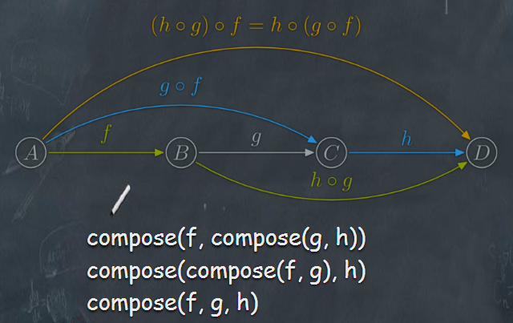

- #### 函数式编程思维

- #### 函数式编程常用核心概念

- #### 当下函数式编程最热的库

- #### 函数式编程的实际应用场景


## 函数式编程思维

***是一门复杂的数学思想***

1. 函数是”第一等公民”
2. 只用”表达式"，不用"语句"
3. 没有”副作用"
4. 不修改状态
5. 引用透明（函数运行只靠参数）

<!-- more -->

## 函数式编程常用核心概念

•纯函数

•函数的柯里化

•函数组合

•Point Free

•声明式与命令式代码

•核心概念

#### 1.纯函数

对于相同的输入，永远会得到相同的输出，而且没有任何可观察的副作用，也不依赖外部环境的状态的函数，叫做纯函数。

```javascript
var xs = [1,2,3,4,5];// Array.slice是纯函数，因为它没有副作用，对于固定的输入，输出总是固定的
xs.slice(0,3);
xs.slice(0,3);
xs.splice(0,3);// Array.splice会对原array造成影响，所以不纯
xs.splice(0,3);
```

#### 2.函数的柯里化

***传递给函数一部分参数来调用它，让它返回一个函数去处理剩下的参数。***

```javascript
var min = 18; 
var checkage = age => age > min;
```

这个函数并不纯，checkage 不仅取决于 age还有外部依赖的变量 min。 纯的 checkage 把关键数字 18 硬编码在函数内部，扩展性比较差，柯里化优雅的函数式解决。

```javascript
var checkage = min => (age => age > min);
var checkage18 = checkage(18); // 先将18作为参数，去调用此函数，返回一个函数age => age > 18;
checkage18(20);// 第二步，上面返回的函数去处理剩下的参数，即 20 => 20 > 18; return true;
```

```javascript
// 柯里化之前
function add(x, y) {
    return x + y;
}
add(1, 2) // 3
// 柯里化之后
function addX(y) {
    return function (x) {
        return x + y;
    };
}
addX(2)(1) // 3
```

事实上柯里化是一种“预加载”函数的方法，通过传递较少的参数，得到一个已经记住了这些参数的新函数，某种意义上讲，这是一种对参数的“缓存”，是一种非常高效的编写函数的方法。

#### 3.函数组合

为了解决函数嵌套过深，洋葱代码：addX(2)(1)、h(g(f(x)))，我们需要用到“函数组合”，我们一起来用柯里化来改他，让多个函数像拼积木一样。

```javascript
const compose = (f, g) => (x => f(g(x)));
var first = arr => arr[0];
var reverse = arr => arr.reverse();
var last = compose(first, reverse);
last([1, 2, 3, 4, 5]); // 5
```

函数组合交换律，类似于乘法交换律：




#### 4.Point Free

***把一些对象自带的方法转化成纯函数,不要命名转瞬即逝的中间变量。***

```javascript
const f = str => str.toUpperCase().split(' ');
```

这个函数中，我们使用了 str 作为我们的中间变量，但这个中间变量除了让代码变得长了一点以外是毫无意义的。

```javascript
var toUpperCase = word => word.toUpperCase();
var split = x => (str => str.split(x));
var f = compose(split(' '), toUpperCase);
f("abcd efgh");
```

把一些对象自带的方法转化成纯函数，然后通过函数组合去调用，这种风格能够帮助我们减少不必要的命名，让代码保持简洁和通用。是不是很方便！

#### 5.声明式与命令式代码

在我们日常业务开发中，写的代码绝大多数都为命令式代码；
我们通过编写一条又一条指令去让计算机执行一些动作，这其中一般都会涉及到很多繁杂的细节。
而声明式就要优雅很多了，我们通过写表达式的方式来声明我们想干什么，而不是通过一步一步的指示。

```javascript
//命令式
let CEOs = [];
for (var i = 0; i < companies.length; i++) {
    CEOs.push(companies[i].CEO)
}
//声明式
let CEOs = companies.map(c => c.CEO);
```

函数式编程的一个明显的好处就是这种声明式的代码，对于无副作用的纯函数，我们完全可以不考虑函数内部是如何实现的，专注于编写业务代码。优化代码时，目光只需要集中在这些稳定坚固的函数内部即可。相反，不纯的函数式的代码会产生副作用或者依赖外部系统环境，使用它们的时候总是要考虑这些不干净的副作用。在复杂的系统中，这对于我们的心智来说是极大的负担。


#### 6.核心概念

##### 高阶函数

​	***把函数当参数，把传入的函数做一个封装，然后返回这个封装函数,达到更高程度的抽象。***

```javascript
//命令式
var add = function (a, b) {
    return a + b;
};
function math(func, array) {
    return func(array[0], array[1]);
}
math(add, [1, 2]); // 3
```

##### 递归与尾递归

指函数内部的最后一个动作是函数调用。 该调用的返回值， 直接返回给函数。 函数调用自身， 称为递归。
```javascript
function quickSort(arr){//！！递归快排！！！
  if(arr.length<=1){return arr;}  //如果数组<=1,则直接返回
  var pivotIndex=Math.floor(arr.length/2);
  var pivot=arr.splice(pivotIndex,1)[0];  //找基准，并把基准从原数组删除
  
  var left=[];  //定义左右数组
  var right=[];

  //比基准小的放在left，比基准大的放在right
  for(var i=0;i<arr.length;i++){
    if(arr[i]<=pivot){
      left.push(arr[i]);
    }
    else{
      right.push(arr[i]);
    }
  }
  //递归
  return quickSort(left).concat([pivot],quickSort(right));
}     
```


如果一个函数中所有递归形式的调用都出现在函数的末尾，我们称这个递归函数是尾递归的。当递归调用是整个函数体中最后执行的语句且它的返回值不属于表达式的一部分时，这个递归调用就是尾递归。尾递归函数的特点是在回归过程中不用做任何操作，这个特性很重要，因为大多数现代的编译器会利用这种特点自动生成优化的代码。


